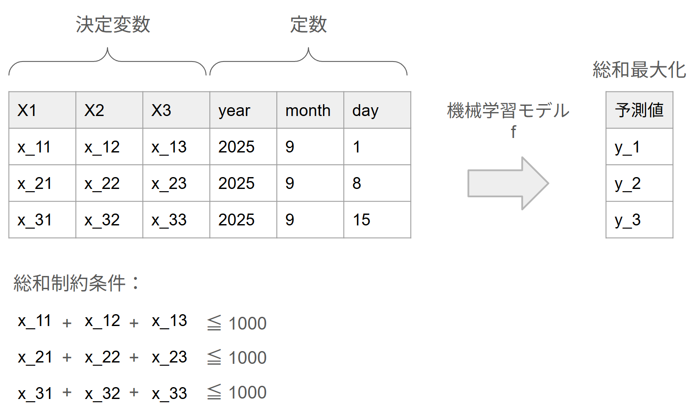

# ML-Opt

## 問題設定
学習済みの機械学習モデルを使って予測値を最大化するような入力特徴量を見つける問題を考える。  
具体的には、各ユニット$i \in N$に対して、最適化可能な入力特徴量（ひとまず連続変数のみ考慮）$\boldsymbol{x_i}$と、外生的に与えられる定数特徴量$\boldsymbol{c_i}$が存在する。  
学習済みモデル$f$は$(\boldsymbol{x_i}, \boldsymbol{c_i})$を入力として予測値（収益、需要、クリック率など）を出力する。  
ここでの目的は、すべてのユニットに対しての予測値の総和を最大化するような$\{\boldsymbol{x_i}\}_{i\in N}$を決定することである。    
ただし、ビジネス上の資源制約や施策の配分制約を表す総和制約を満たさなければならないものとする。

[Gurobi-MLの参考記事](https://gurobi-machinelearning.readthedocs.io/en/stable/auto_examples/example4_price_optimization.html#sphx-glr-auto-examples-example4-price-optimization-py)

問題設定のイメージ図


より正確には以下のように定式化される問題を考える。  

## 集合
- $F$：特徴量集合
- $O \subset F$：最適化対象の特徴量集合
- $C = F \setminus O$：最適化対象外の定数特徴量集合
- $N$：最適化対象のユニット集合
- $J$：総和制約条件の集合
- $\Lambda_j \subset N\times O, \ (j\in J)$：総和制約条件の添字集合


## 定数
- $B_j \in \mathbb{R}, \ (j\in J)$：総和制約条件の上限
- $\boldsymbol{c_i} \in \mathbb{R}^{|C|}, \ (i \in N) $：最適化対象外の定数特徴量
- $l_d, u_d \in \mathbb{R}, \ (d \in O)$：最適化対象特徴量の下限、上限

## 関数
- $f:\mathbb{R}^{|O|}\times \mathbb{R}^{|C|} \to \mathbb{R}$：機械学習モデル（本インスタンスではLightGBMを想定）

## 決定変数
- $\boldsymbol{x_i} \in \mathbb{R}^{|O|}, \ (i \in N) $：最適化対象の入力特徴量

## 定式化
$$
\begin{aligned}
    \underset{x}{\mathrm{max.}} \quad & \sum_{i \in N} f(\boldsymbol{x_i}, \boldsymbol{c_i})  \\  
    \mathrm{s.t.} \quad & \sum_{(i,d) \in \Lambda_j} x_{i,d} \le B_j && \forall j \in J && (1) \\  
    & l_d \le x_{i,d} \le u_d  && \forall (i,d) \in N\times O && (2) \\  
\end{aligned}
$$

目的関数は予測値の総和を最大化を表している。  
(1)は最適化対象決定変数の総和が一定値以下に収まるようにする制約条件を表す。  
(2)は決定変数の下限・上限の制約条件を表す。

## 入力データ形式

インスタンスファイルはJSON形式で提供され、以下の構造を持つ：

### 基本情報
```json
{
  "n_units": 1,                    // ユニット数 |N|
  "n_optimization_features": 7,    // 最適化対象特徴量数 |O|
  "n_constant_features": 3,        // 定数特徴量数 |C|
  "n_sum_constraints": 1           // 総和制約数 |J|
}
```

### 特徴量定義
```json
"features": {
  "optimization_features": [       // 最適化対象特徴量 O = {x1,...,x7}
    {
      "name": "x1",
      "lower_bound": 0.0,          // l_d (下限)
      "upper_bound": 500.0,        // u_d (上限)
      "type": "continuous"
    },
    // ... x2-x7も同様
  ],
  "constant_features": [           // 定数特徴量 C = {year, month, day}
    "year", "month", "day"
  ]
}
```

### ユニット情報
```json
"units": [                         // ユニット集合 N
  {
    "unit_id": 0,                  // ユニットID i
    "constant_features": {         // 定数特徴量 c_i
      "year": 2023,
      "month": 8,
      "day": 6
    }
  }
  // ... 他のユニット（複数ユニットの場合）
]
```

### 制約条件
```json
"constraints": {
  "sum_constraints": [             // 総和制約 j ∈ J
    {
      "constraint_id": "unit_0_total",
      "description": "Total sum constraint for unit 0",
      "variables": [               // Λ_j: 制約に含まれる変数
        {
          "unit_id": 0,            // ユニットID i
          "feature": "x1",         // 特徴量 d
          "coefficient": 1.0       // 係数
        },
        // ... x2-x7も同様
      ],
      "upper_bound": 1000.0        // B_j: 制約上限値
    }
  ]
}
```

### モデル情報
```json
"model": {
  "file_path": "lgbm_100.txt",     // 学習済みモデルファイル
  "input_features_order": [        // モデル入力の特徴量順序
    "x1", "x2", "x3", "x4", "x5", "x6", "x7",
    "year", "month", "day"
  ]
}
```

### インスタンスサイズ
ひとまず以下のインスタンスを生成している  

- **ユニット数**：1, 10, 50  
- **予測モデルの木の数**： 100, 500, 1000, 5000 (n_estimators)  
- **決定変数範囲**：$x_1, ..., x_7 \in [0, 500]$（すべての最適化対象特徴量に対して一律）  
- **制約条件**：各ユニットごとに $x_1 + ... + x_7 \le 1000$  

### ファイル名規則
- インスタンス: `instance_{n_units}units_{n_estimators}est.json`
- モデル: `lgbm_{n_estimators}.txt`
